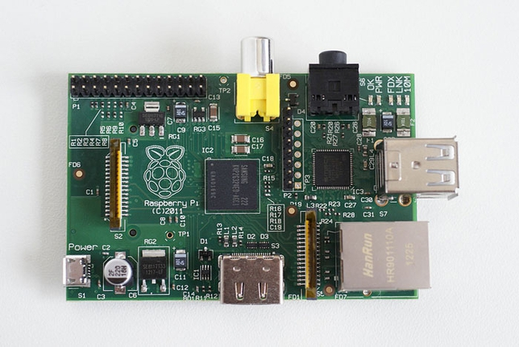

#物聯網相關開源硬體

##Arduino

語言: ``Processing``,``C++``,``C``

> Arduino 是一款便捷靈活、方便上手的開放源碼軟硬體平台，包含硬體（各種型號的 arduino板）和軟體（arduino IDE。它適用於藝術家、設計師、愛好者和對於“互動”有興趣的朋友們。 

> Arduino，是一個基於開放原始碼的軟硬體平台，構建於開放原始碼simple I/O介面板，並且具有使用類似Java，C語言的Processing/Wiring開發環境。 

> Arduino能通過各式各樣的傳感器來感知環境，通過控制燈光、馬達和其他的裝置來回饋、影響環境。板子上的微控制器可以通過Arduino的程式語言來編寫程式，編譯成二進制文件，燒錄進微控制器。對Arduino的编程是利用 Arduino程式語言 (基於Wiring)和 Arduino開發環境(based on Processing來實現的。基於Arduino的項目，可以只包含Arduino，也可以包含Arduino和其他一些在PC上運行的軟體，他們之間進行通訊 (比如 Flash, Processing, MaxMSP)來實現。

[Arduino Yun](./ArduinoYun.md)

> Arduino Yún是Linux與Arduino相結合的WiFi產品。Yún就是漢語中的”雲“，目的是讓該版子可輕鬆連接到複雜的網絡服務。Arduino Yún是基於ATMEGA32U4和Atheros AR9331，Atheros AR9331可以運行一個基於Linux和OpenWRT的操作系統Linino，Arduino Yún已内建乙太網路和WiFi，支援USB-A端口、Micro-SD卡插槽、20個數位輸入/輸出端口（其中7個可以用於PWM, 12個可以用於Analog Input）、一個16 MHz晶體振盪器、一個微型USB連接、一個ICSP頭和一個復位按鈕。

##Raspberry Pi 

语言: Any
主要有:``Python``,``C#``,``Ruby``

> 树莓派(raspberry pi)，是一款基于linux系统的、只有一张信用卡大小的卡片式计算机。研发树莓派的最初目的是通过低价硬件及自由软件来推动在学校的基础的计算机学科教育，但很快树莓派就得到计算机和硬件爱好者青睐；他们用它学习编程，并创造出各种各样新奇的、风靡一时的软硬件应用。

> 在接口方面，Raspberry Pi提供了可供键鼠使用的USB接口，此外还有快速以太网接口、SD卡扩展接口以及1个HDMI高清视频输出接口，可与显示器或者TV相连。

##Spark Core

语言: ``Processing``,``C++``,``C``

[Spark Core](./SparkCore.md)

> Spark 的核心芯片（Spark Core）采用兼容 Arduino 的 ARM Cortex-M3 平台，搭载一块 德州仪器（TI）CC3000 WiFi 芯片。一切的开始是你再也不用连接 USB 线到电脑，而只需通过 WiFi 即可刷入代码。更重要的是，他们提供了一个免费的云服务，类似非硬件的云服务 Heroku 那样，可以让使用核心板块的自定义程序托管在上面。开发者们可以立即测试自己产品的效果。

##WIFI-DUINO

> WiFi-Duino是一个可以接入wifi（或者建立wifi热点）的兼容Arduino系列开发软件的开发板，基于Atmega32U4和HLK-RM04 WiFi模块制作，提供比Arduino Yun更加完善的功能，售价仅需￥169。您可以通过它将您的电路设计和互联网相连，快速开发出物联网应用。

> 和Arduino Yun不同的是，我们提供了板载的稳压芯片，WiFi-Duino可以通过USB接口供电，也可以通过供电插座供电，板载检测器会自动切换电源。外部供电设备可以是AC-to-DC配适器或者电池。配适器的连接方式是通过向板载的电源插座插入一个2.1mm的插头（中心为正）；电池则是直接插入供电端口（Gnd和Vin排针）。

>理论上WiFi-Duino可以在6—15伏内正常工作。然而，如果供电不足7伏，5V排针的供电电压可能会小于5伏，板载插座则有可能不能稳定工作。如果供电大于12伏，稳压器则会过热，板载插座也会受损。所以，推荐的外部电源电压范围是7—12伏。

##LinkIt ONE

联发科技创意实验室项目初期将以联发科技的LinkIt™开发平台为主，该平台主要以联发科技Aster(MT2502)系统单芯片为核心。LinkIt开发平台具备完整的联网功能和良好的扩充性，通过高度整合以降低额外硬件连接设备的数量。而且，联发科技所提供的硬件参考设计，可让开发可穿戴及物联网原型设备的流程更加简化且更具成本效益。

LinkIt开发平台由下以部份组成:

- 系统单芯片（SoC）—联发科技Aster(MT2502)是全球体积最小、已商用的可穿戴SoC，可搭配Wi-Fi (MT5931) 和 GPS (MT3332)，提供出色的高性能低功耗表现。

- LinkIt OS— LinkIt OS是一个先进且精简的操作系统，可有效控制软件、AsterSoC和与其搭配的芯片组，以及大量传感器和周边硬件。

- 硬件开发包（HDK）— 首先推出的是与深圳矽递科技有限公司 （Seeed Studio）合作的LinkItONE硬件开发包，让在LinkIt ONE上添加传感器、周边器件和Arduino功能扩展板的工作更容易，进而打造功能完善的产品原型设计。

- 软件开发包（SDK）— 创客们可利用软件开发包中所提供的应用程序界面（API），轻松简单得将现有的Arduino编码迁移到LinkIt ONE上。另外，还有一系列API可让创客们使用LinkIt ONE上的各种通信功能，包括GSM, GPRS, Bluetooth和Wi-Fi等。

为确保开发者们能够充分利用LinkIt平台，联发科技创意实验室提供一系列服务，包括：

- 完整的商业和技术概述

- 解决方案目录：开发者们可以在此分享他们有关产品设备、应用程序和服务方面的信息，增加与联发科技的客户和伙伴未来的合作机会。

- 各种技术支持：包括由联发科技专业技术人员维护的FAQ和论坛，并针对解决方案目录里正在开发的解决方案，为开发者提供免费技术支持。

- 深圳矽递科技有限公司（SeeedStudio）创始人兼首席执行官潘昊表示：“当创客们仍然在采用传统工业用组件开发新型物联网设备时，矽递为联发科技LinkIt开发平台提供的LinkIt ONE硬件开发包，可以帮助创客们更容易、更快速地将产品原型设计推向市场，我们对此感到非常高兴。”

创客、设计师和开发者们今天就可以登录联发科技创意实验室（http://labs.mediatek.com），下载全套的工具和文件。

##Seeeduino Cloud

> Seeeduino Cloud是一款基于Dragino WiFi 物联网模块HE和ATmega32u4的微控制器板。HE是一个高性能、低成本的150M，2.4G WiFi模块，在汉语中意味着核心，并且它内置开源的OpenWrt系统。Seeeduino Cloud完全兼容Arduino，Grove，扩展板和IDE（版本高于1.5.3）。除了Arduino常规接口，Seeeduino Cloud还支持内置的以太网和WiFi，USB-A端口使得需要网络连接和大量存储的原型设计非常容易。将Seeeduino Cloud用作一个物联网网关也不失为一个好主意。

- 兼容Arduino Yun

- 基于Dragino WiFi 物联网模块HE

- 内置开源OpenWrt系统

- 支持2.4GHz WiFi。802.11b/g/n

- 支持以太网

- 支持USB2.0

- 尺寸：75.10mm x 53.39mm x 11.50mm / 2.95" x 2.10 x 0.45"

- 工作温度：-20~60°C

- 表面颜色：红色

##Spark Core

> Spark Core 是一款 Arduino 的 WiFi 开发板，内建云端开发平台，让工程师可以轻松开发出任何与网络链接的硬设备~~ 这款开发板内建 72 MHz ARM Cortex M3、号称市面上最好用的 TI WiFi 模块、无线程序编辑、PIN out 和 peripheral 埠，开发起来相当方便。

> 从外观上看，这是一个只有不到两个手指宽的电路板，正反两面都嵌有芯片，背面有针脚，显然它可以与某些设备相连。它的核心是一颗运行频率为 72MHz 的 ARM Cortex-M3 芯片，以及 Wi-Fi 模块。

##WiDo物联网主控器

> Wido是一款轻量化WIFI传感器节点控制器，兼容Arduino Leonardo. 通过Wido你可以轻松对接国内外各大物联网平台，监控环境与设备数据。

 - Arduino Leonardo兼容设计

 - 支持Micro USB直插供电与编程

 - 外接电源电压范围：7-12v

 - 板载WIFI嵌入式模组，2.4GHz IEEE 802.11 b/g

 - SPI驱动WIFI模组

 - 板载Micro SD卡槽

 - PCB 2.4G天线，提供接近手机的WIFI信号

驱动引脚：

 - WIFI模块—D7(IRQ),D5(VBAT),D10(CS),D14(MISO),D15(SCK),D16(MOSI)

 - MicroSD —D4(CS),D14(MISO),D15(SCK),D16(MOSI)

PS:4个Arduino Leonardo占用，MicroSD和CC3000都通过SPI驱动，顾有硬件串口资源可扩展其他功能

#物联网相关闭源硬件

#未知

[WiDo物联网主控器](./WiDo.md)

[WIFI-DUINO](./WIFI-DUINO.md)

[Seeeduino Cloud](./SeeeduinoCloud.md)

[LinkIt One](./LinkItOne.md)